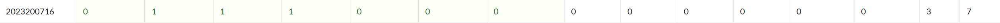

# bomblab 报告

姓名：刘志伟

学号：2023200716

| 总分 | phase_1 | phase_2 | phase_3 | phase_4 | phase_5 | phase_6 | secret_phase |
| --------- | ------------- | ------------- | ------------- | ----------------- |-----------|-----------|-----------|
| 7        | 1            | 1            | 1            | 1 |1  |1  |1  |


scoreboard 截图：



<!-- TODO: 用一个scoreboard的截图，本地图片，放到 imgs 文件夹下，不要用这个 github，pandoc 解析可能有问题 -->

## 解题报告

<!-- 对你拆掉的每个phase进行分析，并写出你得出答案的历程 -->

<!-- 如果能用伪代码还原题目源代码最佳（不属于先前提到的大段代码），语言描述自己的分析也可，每道题目的图片不建议超过两张 -->

### phase_1

```c
Life is to become food for each other, no matter evil or good.
```
本题为一个简单的字符串比较题目，比较输入字符串与目标字符串是否相等。代码还原后为

```c
void phase_1(const char *input) {
    // 假设目标字符串是实际值（比如 "secret123"）
    const char *target = "secret123";  
    if (strcmp(input, target) != 0) {
        explode_bomb();
    }
}
```
通过x/s $rsi即可查看目标字符串，输入与目标字符串相同的字符串即可通过本题。


### phase_2

```c
1155856 1102084 507214 563818
```
本题是一个矩阵乘法计算，代码还原后为

```c
void phase_2(const char *input) {
    int input_nums[4];
    int calc_results[4];  
    // 读取4个输入整数
    if (sscanf(input, "%d %d %d %d", &input_nums[0], &input_nums[1], &input_nums[2], &input_nums[3]) != 4) {
        explode_bomb();
    }
    // 矩阵乘法计算结果（省略）

    for (int i = 0; i < 4; i++) {
        if (calc_results[i] != input_nums[i]) {
            explode_bomb();
        }
    }
}
```
直接的思路是找到两个矩阵的初始值然后进行计算，发现数值很大。多想一下发现可以从最后的结果比较入手，试错来得到答案。

具体而言，我先随便输入答案`1 2 3 4`，发现结果不对，此时我直接查看结果比较处cmp % eax,(% rsp,% rbx,1) 中%eax的值，发现是1155856，即可得到答案的第一个数。接着输入`1155856 2 3 4`，再次查看%eax的值，发现是1102084，即可得到答案的第二个数。依次类推，即可得到答案的第三个数和第四个数。用此方法可跳过矩阵计算步骤直接得到答案。

### phase_3
```c
5 -676
```
这段代码实现了一个跳表，输入的两个数需要满足一定的条件才能进入跳表不会触发爆炸的模块，代码还原后为
```c
void phase_3() {
    int val1, val2;
    if(val2>=0) 一定会爆炸
    if(val1 == 0,1,2,3) 代码会跳转到15ae之前执行，即一定会发生爆炸
    if(val1 == 6,7) 无法通过后续val1<=5d的限制，一定会爆炸
    if(val1 == 4) 计算得val2=0，无法通过val2<0的限制，会爆炸
    if(val1 == 5) 计算得val2=-676，满足题目所有限制
```
如伪代码所示，本题逻辑比较简单，找出val1的所有限制，发现只能是4和5，而4和5的val2值计算分别为0和-676，-676小于0，符合题目所有限制，因此只有输入5 -676才能通过跳表。值得注意的是各个case中有跳转操作，只有跳转到15ae之后继续执行才不会强制爆炸，这个限制不是直接给出的。

### phase_4
```c
31 AC
```
本题其实是要得出func4_1和func4_2的正确返回值，这两个函数的代码还原后为
```c
int func4_1(int n) {
    if (n <= 0) return 0;
    if (n == 1) return 1;
    return 2 * func4_1(n - 1) + 1;
}

void func4_2(int n, int target, char c1, char c2, char c3, char *out) {
    if (n == 1) {
        out[0] = c1;
        out[1] = c2;
        out[2] = '\0';
        return;
    }
    int t = func4_1(n - 1);
    if (t < target) {
        if (t + 1 == target) {
            out[0] = c1;
            out[1] = c2;
            out[2] = '\0';
            return;
        } else {
            int new_target = target - t - 1;
            func4_2(n - 1, new_target, c3, c2, c1, out);
            return;
        }
    } else {
        func4_2(n - 1, target, c1, c3, c2, out);
        return;
    }
}
```
phase_4中要求输入的第一个值为func4_1(5)=31，func4_2(5, 1, 'A', 'C', 'B', buf)，func_2中三个字母的顺序变化为ACB->ABC->ACB->ABC->ACB，最后取前两个字母即AC。

值得注意的是AC和31的输入顺序需要通过x/s 0x5555555571f5查看得到，解决本题时在输入AC 31却仍然报错时卡了很久，最后才发现是输入顺序错误。

### phase_5
```c
#&-% (
```
本题需要我们根据函数逻辑生成目标字符串，但生成逻辑比较复杂，还原后的代码如下
```c
void phase_5(const char *input) {
    char transformed[7];    

    if ((int)strlen(input) != 6) {
        explode_bomb();
    }

    for (i = 0; i < 6; ++i) {
        int idx = ((int)(signed char)input[i] + 15) & 0xF; 
        transformed[i] = array_0[idx];
    }

    if (strings_not_equal(transformed, target_string) != 0) {
        explode_bomb();
    }
}
```
首先本题可以从strings_not_equal函数入手找到目标字符串devils，再看要求输入是6个字符，大致可以猜出是要做字符串变换。仔细看变换逻辑，发现是对每个字符做 (signed char + 15) & 0xF，然后用结果索引 array_0，写入 transformed。

那么首先用x/16bx 0x555555557240拿到array_0的内容，即"maduiersnfotvbyl"，目标devils对应的下标为2,5,12,4,15,7，即((input[i] + 15) & 0xF) = [2,5,12,4,15,7]，进而得到input[i] ≡ (index - 15) mod 16，求出input=[3,6,13,5,0,8]，在加32转化为单字符的ASCII码即可得到目标字符串#&-% (。

### phase_6
```c
2 3 1 5 4 6
```
本题是对链表节点进行重新排序，输入的六个数经过变换后得到索引，根据索引重新排序链表节点并且要满足降序的要求，还原后的代码如下
```c
void phase_6(void) {
    read_six_numbers(nums);
    // 检查输入是否在 1..6 范围内，且不重复
    for (i = 0; i < 6; ++i) {
        if (nums[i] < 1 || nums[i] > 6) {
            explode_bomb(); 
        }
        for (j = i + 1; j < 6; ++j) {
            if (nums[i] == nums[j]) {
                explode_bomb(); 
            }
        }
    }
    // 进行索引转换
    for (i = 0; i < 6; ++i) {
        nums[i] = 7 - nums[i];
    }

    node *node_map[6];
    node *base = &node1; 
    //根据索引构建新链表
    for (i = 0; i < 6; ++i) {
        int k = nums[i];        
        node *p = &node1;       
        while (--k > 0) {
            p = p->next;
        }
        node_map[i] = p;
    }

    for (i = 0; i < 5; ++i) {
        node_map[i]->next = node_map[i + 1];
    }
    node_map[5]->next = NULL;
    // 检查链表是否按降序排列
    node *cur = node_map[0];
    for (i = 0; i < 5; ++i) { 
        node *nxt = cur->next;
        if (nxt->value < cur->value) {
            explode_bomb();
        }
        cur = nxt;
    }
}
```
本题的关键点在于拿到6个节点的值，通过给出的地址执行x/24wx 0x555555559210可以得到前5个结点的值，值得注意的是第5个结点的next指向0x555555559160，而不是顺序排序的0x555555559260，因此第6个结点的值需要单独找到并查看。

最终，6个节点的值分别为235，498，325，788，827，657，因此节点的索引为546231，由于进行了7-i的索引转换，因此最终链表的顺序为231546。

### secret_phase
```c
33311
```
本题先通过查找发现secret_phase出现在phase_defused函数中，解析phase_defused函数可以发现解锁条件为在phase_6中输入的6个数字后面加一个coding。再看secret_phase函数，发现其实是要解决func7中的问题，func7的代码还原如下
```c
// 棋盘地图 (8x8)，1表示可以走，0表示不能走
int board[8][8] = {
    {0, 0, 1, 0, 0, 1, 0, 0},  
    {0, 0, 0, 1, 0, 0, 0, 1},  
    {1, 0, 1, 0, 0, 1, 0, 0},  
    {1, 0, 0, 0, 0, 0, 0, 0},  
    {0, 1, 0, 0, 1, 0, 1, 0},  
    {1, 0, 0, 1, 1, 0, 0, 0},  
    {0, 0, 0, 0, 0, 1, 0, 1},  
    {0, 1, 0, 0, 0, 0, 0, 0}   
};

// 格式: {行变化, 列变化}
int moves[8][2] = {
    {-2, +1},  // 方向0: 向上2，向右1
    {-1, +2},  // 方向1: 向上1，向右2
    {+1, +2},  // 方向2: 向下1，向右2
    {+2, +1},  // 方向3: 向下2，向右1
    {+2, -1},  // 方向4: 向下2，向左1
    {+1, -2},  // 方向5: 向下1，向左2
    {-1, -2},  // 方向6: 向上1，向左2
    {-2, -1}   // 方向7: 向上2，向左1
};

// 检查位置是否在棋盘内且可走
bool is_valid_position(int row, int col) {
    return (row >= 0 && row < 8 && col >= 0 && col < 8 && board[row][col] == 1);
}

// 主逻辑函数
bool func7(char* input_str, int current_row, int current_col, int str_index) {
    // 基本情况1: 如果字符串结束了
    if (input_str[str_index] == '\0') {
        // 检查是否到达目标位置 (4,7)
        return (current_row == 4 && current_col == 7);
    }
    
    // 基本情况2: 字符串太长（最多处理20个字符）
    if (str_index >= 20) {
        return false;
    }
    
    // 获取当前字符
    unsigned char c = input_str[str_index];
    c = (int)c;
    row_next = current_row + moves[c][0];
    col_next = current_col + moves[c][1];
    // 检查下一步后位置是否合法
    if (!is_valid_position(row_next, col_next)) {
        return false;
    }
    
    return func7(input_str, row_next, col_next, str_index + 1);
}
```
本题解析出移动方式是走“日”字，就大概猜出是要在棋盘上走“日”字，到达目标位置(4,7)了。接下来要做的是拿到地图上的所有可走位置，注意这里的地图是用链表存储的，因此存储地址不连续，需要由next指针指向的地址去找到row0到row7的值。

最终解析出来的地图和走法如上述代码中所示，走法索引为33311，即可从(0,0)出发，走“日”字到达(4,7)。


## 反馈/收获/感悟/总结

<!-- 这一节，你可以简单描述你在这个 lab 上花费的时间/你认为的难度/你认为不合理的地方/你认为有趣的地方 -->

<!-- 或者是收获/感悟/总结 -->

<!-- 200 字以内，可以不写 -->

## 参考的重要资料

<!-- 有哪些文章/论文/PPT/课本对你的实现有重要启发或者帮助，或者是你直接引用了某个方法 -->

<!-- 请附上文章标题和可访问的网页路径 -->
